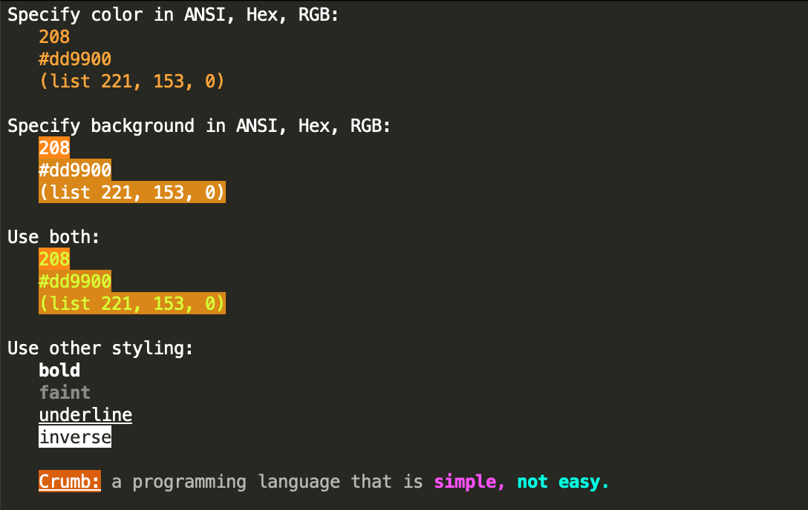

# colors.crumb

`colors.crumb` is a [Crumb](https://github.com/liam-ilan/crumb) usable providing basic terminal styling functions as well as access to RGB, HEX, ANSI conversion functions.

## Usage

1. Download https://github.com/ronilan/colors.crumb/blob/main/colors.crumb
2. Place it in your Crumb project
3. Use it.

## Examples

This code:

```
(use "./colors.crumb" {
  // loop forever
  (until "stop" {state n ->
    
    // print random slash with random color
    c = (add 16 (remainder (integer (add n (multiply (random) 100))) 216))
    (print (if (integer (add (random) 0.5)) {<- (color c "╱")} {<- (color c "╲")}))

    // wait to slow down animation
    (wait 0.001)
  })
})

```
will produce the following:

 

This code:

```
(use "./colors.crumb" {
  (loop 100 {i -> 
    i = (add i 1)
    (if (is (remainder i 15) 0) {
      (print (bold (color 88 (background 220 "fizzbuzz"))) "\n")
    } {
      (if (is (remainder i 3) 0) {
        (print (color 36 "fizz") "\n")
      } {
        (if (is (remainder i 5) 0) {
          (print (color "#88ddff" "buzz") "\n")
        } {
          (print (color (list 255 0 127) (string i)) "\n")
        })
      })
    })
  })
})
```
will produce the following:

 

This code:

```
(use "./colors.crumb" {

  (print "\e[H\e[2J")
  (print "Specify color in ANSI, Hex, RGB:\n")
    (print "  " (color 208 "208")  "\n")
    (print "  " (color "#dd9900" "#dd9900")  "\n")
    (print "  " (color (list 221 153 0) "(list 221, 153, 0)") "\n\n")

  (print "Specify background in ANSI, Hex, RGB:\n")
    (print "  " (background 208 "208")  "\n")
    (print "  " (background "#dd9900" "#dd9900")  "\n")
    (print "  " (background (list 221 153 0) "(list 221, 153, 0)") "\n\n")

  (print "Use both:\n")
    (print "  " (color "#ddff00" (background 208 "208")) "\n")
    (print "  " (color "#ddff00" (background "#dd9900" "#dd9900")) "\n")
    (print "  " (color "#ddff00" (background (list 221 153 0) "(list 221, 153, 0)")) "\n\n")

  (print "Use other styling:\n")
    (print "  " (bold "bold") "\n")
    (print "  " (faint "faint") "\n")
    (print "  " (underline "underline") "\n")
    (print "  " (inverse "inverse") "\n\n")

    (print 
      "  " 
      (background 166 (underline "Crumb:")) 
      (color "#999999" "a programming language that is") 
      (bold (color "#ff00dd" "simple,")) 
      (bold (color "#00ffdd" "not easy.")) 
      "\n\n"
    )

})
```

Will produce the following:

 

## Running Examples

With Docker:

Build: 
```
docker build -t colors.crumb git@github.com:ronilan/colors.crumb.git#main
```
Run: 
```
docker run --rm -it colors.crumb
```

Or "all in one": 
```
docker run --rm -it $(docker build -q git@github.com:ronilan/colors.crumb.git#main)
```

Then in the shell: 
```
./crumb examples/10-print.crumb
```

## Local Dev

Clone the repo: 
```
git clone git@github.com:ronilan/colors.crumb.git
```

CD into directory: 
```
cd colors.crumb
```

Build Crumb interpreter: 
```
chmod +x build-crumb.sh && ./build-crumb.sh
```

Run:
```
./crumb examples/10-print.crumb
```

###### Fabriqué au Canada : Made in Canada 🇨🇦
