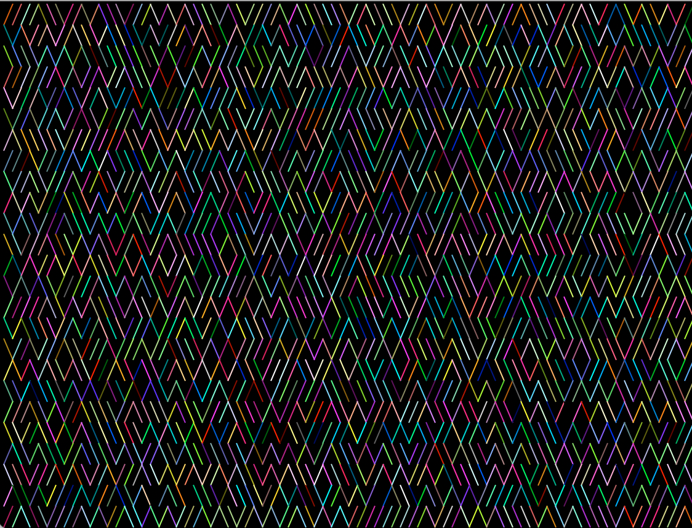
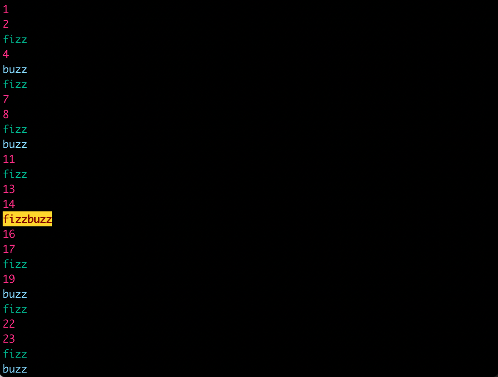
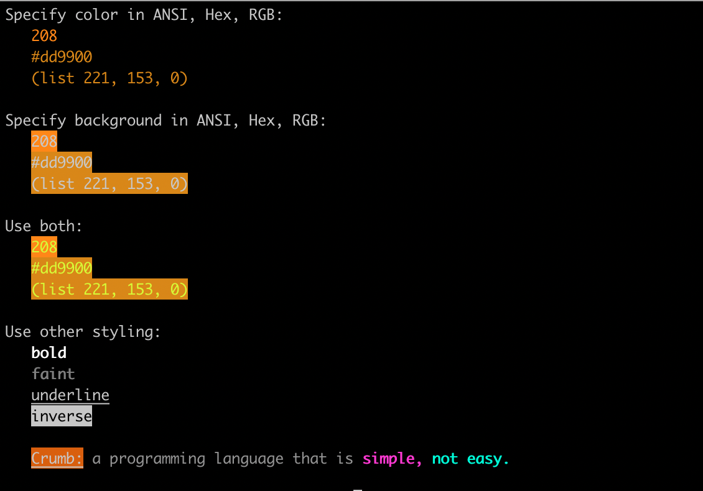

# colors.crumb

`colors.crumb` is a [Crumb](https://github.com/liam-ilan/crumb) usable providing basic terminal styling functions as well as access to RGB, HEX, ANSI conversion functions.

## Usage

1. Download https://github.com/ronilan/colors.crumb/blob/main/colors.crumb
2. Place it in your Crumb project
3. Use it.

## Examples

This code:

```
(use "./colors.crumb" {
  // loop forever
  (until "stop" {state n ->
    
    // print random slash with random color
    c = (add 16 (remainder (integer (add n (multiply (random) 100))) 216))
    (print (if (integer (add (random) 0.5)) {<- (color c "╱")} {<- (color c "╲")}))

    // wait to slow down animation
    (wait 0.001)
  })
})

```
will produce the following:

 

This code:

```
(use "./colors.crumb" {
  (loop 100 {i -> 
    i = (add i 1)
    (if (is (remainder i 15) 0) {
      (print (bold (color 88 (background 220 "fizzbuzz"))) "\n")
    } {
      (if (is (remainder i 3) 0) {
        (print (color 36 "fizz") "\n")
      } {
        (if (is (remainder i 5) 0) {
          (print (color "#88ddff" "buzz") "\n")
        } {
          (print (color (list 255 0 127) (string i)) "\n")
        })
      })
    })
  })
})
```
will produce the following:

 

This code:

```
(use "./colors.crumb" {

  (print "\e[H\e[2J")
  (print "Specify color in ANSI, Hex, RGB:\n")
    (print "  " (color 208 "208")  "\n")
    (print "  " (color "#dd9900" "#dd9900")  "\n")
    (print "  " (color (list 221 153 0) "(list 221, 153, 0)") "\n\n")

  (print "Specify background in ANSI, Hex, RGB:\n")
    (print "  " (background 208 "208")  "\n")
    (print "  " (background "#dd9900" "#dd9900")  "\n")
    (print "  " (background (list 221 153 0) "(list 221, 153, 0)") "\n\n")

  (print "Use both:\n")
    (print "  " (color "#ddff00" (background 208 "208")) "\n")
    (print "  " (color "#ddff00" (background "#dd9900" "#dd9900")) "\n")
    (print "  " (color "#ddff00" (background (list 221 153 0) "(list 221, 153, 0)")) "\n\n")

  (print "Use other styling:\n")
    (print "  " (bold "bold") "\n")
    (print "  " (faint "faint") "\n")
    (print "  " (underline "underline") "\n")
    (print "  " (inverse "inverse") "\n\n")

    (print 
      "  " 
      (background 166 (underline "Crumb:")) 
      (color "#999999" "a programming language that is") 
      (bold (color "#ff00dd" "simple,")) 
      (bold (color "#00ffdd" "not easy.")) 
      "\n\n"
    )

})
```

Will produce the following:

 

## Running Examples

### With Docker:

Build: 
```
docker build -t colors.crumb git@github.com:ronilan/colors.crumb.git#main
```
Run: 
```
docker run --rm -it colors.crumb
```

Or "all in one": 
```
docker run --rm -it $(docker build -q git@github.com:ronilan/colors.crumb.git#main)
```

Then in the shell: 
```
./crumb examples/10-print.crumb
```

### Locally

Clone the repo: 
```
git clone git@github.com:ronilan/colors.crumb.git
```

CD into directory: 
```
cd colors.crumb
```

Build Crumb interpreter: 
```
chmod +x build-crumb.sh && ./build-crumb.sh
```

Run:
```
./crumb examples/10-print.crumb
```

## Reference 
### Styling

- `(color def str)`
  - Returns `str` wrapped in color escape codes calculated from `def`.
  - `def` can be of a any type. Number is assumed ANSI code. String is assumed HEX value. List is assumed RGB.
  - `def`: `integer`, `string`, `list`.
  - `str`: `string`

- `(background def str)`
  - Returns `str` wrapped in background escape codes calculated from `def`.
  - `def` can be of a any type. Number is assumed ANSI code. String is assumed HEX value. List is assumed RGB.
  - `def`: `integer`, `string`, `list`.
  - `str`: `string`

- `(bold str)`
  - Returns `str` wrapped in bold escape codes.
  - `str`: `string`

- `(underline str)`
  - Returns `str` wrapped in underline escape codes.
  - `str`: `string`

- `(faint str)`
  - Returns `str` wrapped in faint escape codes.
  - `str`: `string`

- `(inverse str)`
  - Returns `str` wrapped in inverse escape codes.
  - `str`: `string`

### Color Definition Conversion

- `(hex_to_ansi_8 str)`
  - Returns `integer` ANSI color number most closely matching the HEX color definition.
  - `str`: `string`

- `(ansi_8_to_hex num)`
  - Returns `string` HEX color definition matching the ANSI color number.
  - `num`: `integer`

- `(rgb_to_ansi_8 arr)`
  - Returns `integer` ANSI color number most closely matching the RGB color definition.
  - `arr`: `list`

- `(ansi_8_to_rgb num)`
  - Returns `list` RGB color definition (three numbers between 0 and 255) matching the ANSI color number.
  - `num`: `integer`

- `(rgb_to_hex arr)`
  - Returns `string` HEX color definition matching the RGB color definition.
  - `arr`: `list`

- `(hex_to_rgb str)`
  - Returns `list` RGB color definition (three numbers between 0 and 255) matching the HEX color definition.
  - `str`: `string`

### Base Conversions

- `(base_10_to_16 num)`
  - Returns a string representation of `num` in base 16.
  - `num`: `integer`

- `(base_10_to_6 num)`
  - Returns a string representation of `num` in base 6.
  - `num`: `integer`

- `(base_10_to_2 num)`
  - Returns a string representation of `num` in base 2.
  - `num`: `integer`

- `(base_10_to_other num base)`
  - Returns a string representation of `num` in `base`. `base` must be in range 2 to 16.
  - `num`: `integer`, `base`: `integer`

- `(base_16_to_10 str)`
  - Returns an integer derived from `str` in base 16.
  - `str`: `string`

- `(base_other_to_10 str base)`
  - Returns an integer derived from `str` in `base`. `base` must be in range 2 to 16.
  - `str`: `string`, `base`: `integer`

### Utility

- `(ansi_from_color_definition def)`
  - ANSI color calculated from `def`.
  - `def` can be of a any type. Number is assumed ANSI code. String is assumed HEX value. List is assumed RGB.
  - `def`: `integer`, `string`, `list`.
  - `str`: `string`

- `(hex_char_to_dec str)`
  - Returns an integer derived from `str` in base 16.
  - `str`: `string`

- `(dec_to_hex_char num)`
  - Returns a string representation of `num` in base 16.
  - `num`: `integer`

### String Utility

- `(string_to_list str)`
  - Returns `list` containing each character of the string.
  - `str`: `string`

- `(list_to_string arr)`
  - Returns `string` a reduction of the array.
  - `arr`: `list`

- `(string_reverse str)`
  - Returns `str` reversed.
  - `str`: `string`

- `(string_pad_start str length char)`
  - Returns `str` of length `count` padded at the start with `char` as many times as needed.
  - `str`: `string`


###### Fabriqué au Canada : Made in Canada 🇨🇦
